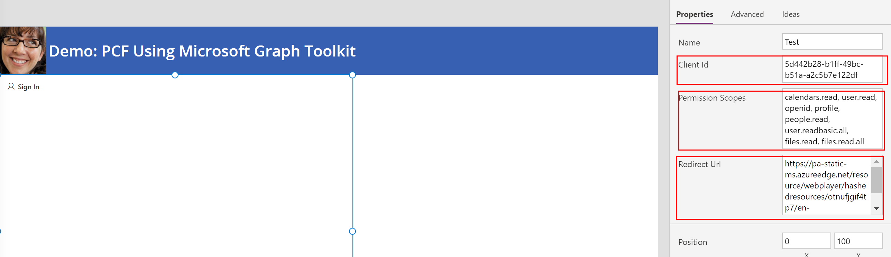
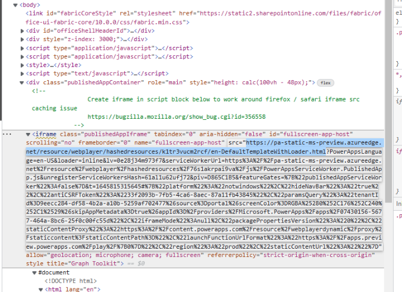
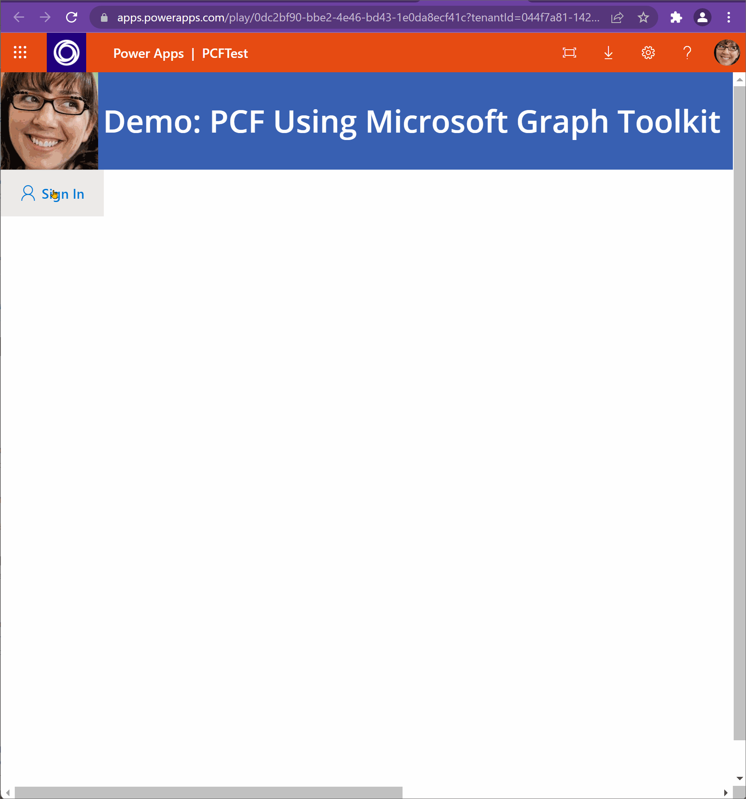
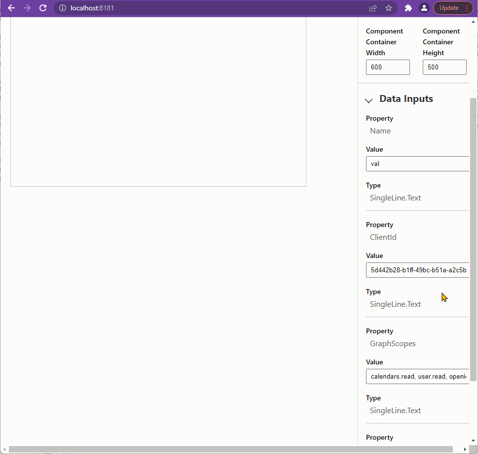

# PCF-MGT-Sample
Shows how to use Microsoft Graph Toolkit components in Power Apps Component Framework (PCF) custom controls. This sample shows how to authenticate using MGT MSAL provider and then shows how to use Agenda and FileList components. 
The FileList component also supports Upload of files to SharePoint Online and ODB. Based on my testing, it can support large files upload too. This will help get around the upload limit of 100MB in Power Apps and Power Automate.

# Configuration
1. After you register Azure AD App. Add the PCF component to your Power App. Configure with the Client ID (App Id), Scopes and Redirect Url (see step 2).

2. You need to set the redirect URL that is unique to the Power App the component is embedded in. Once you add the PCF component to the Power App and play it, you can identify the source url of the iframe as follows.

3. Copy that URL and add that as the SPA redirect url for your Azure AD App. 

# Pain Points and Things to note
1. As noted above identifying the iframe url for the PCF component and setting that as the redirect URL is an issue.
2. While testing using Test Harness the PCF with MGT works perfectly as long as your add http://localhost:8181 to redirect URL (under SPA)
3. As you can see in demo below although user is logged in, MGT component is not picking up the context. User must login again.

# Demo
Demo of PCF in Power App

Dem of PCF in Test Harness (Note: You must set redirect url to localhost:8181 while testing in test harness)

